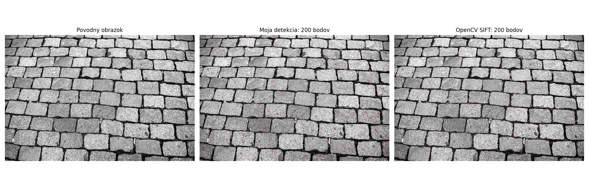
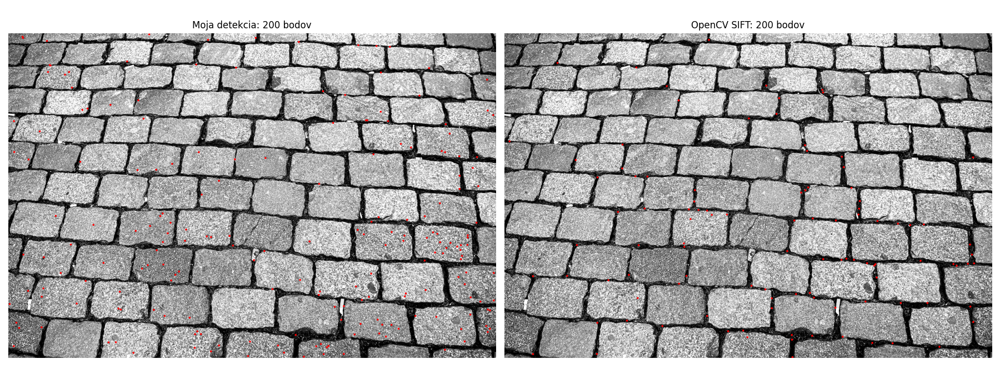
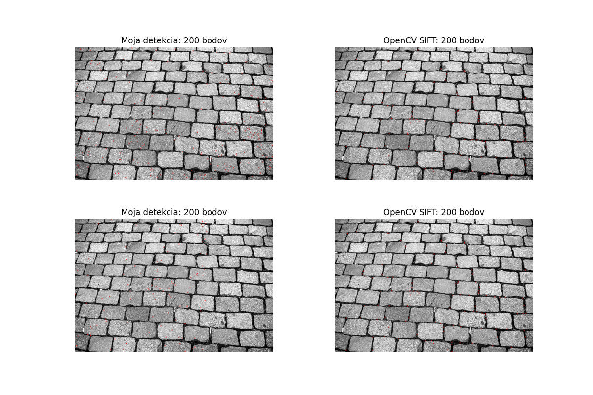
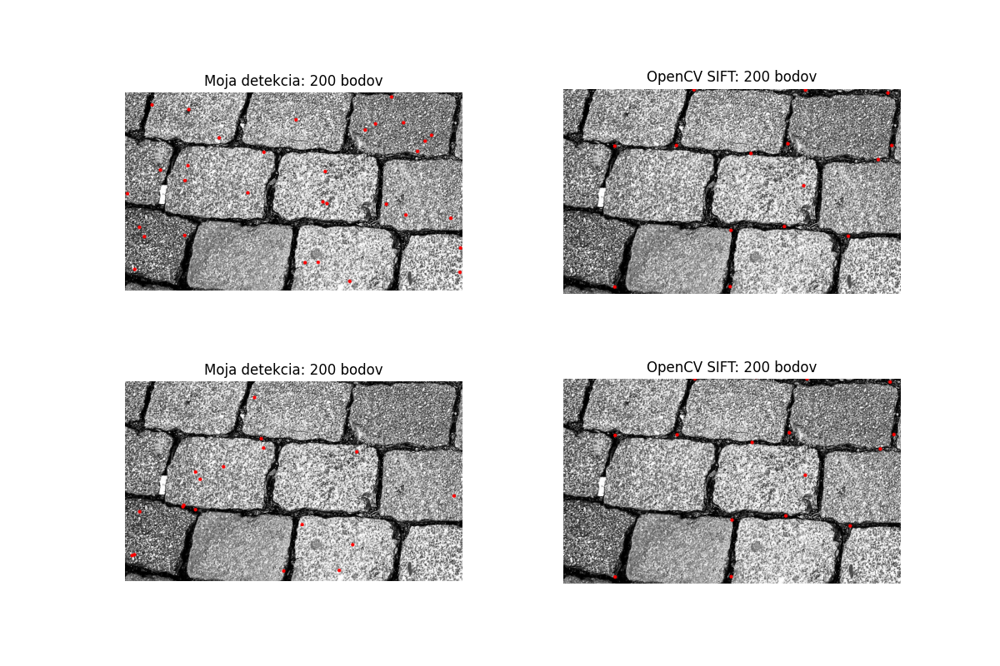

# Sift
SIFT (Scale-Invariant Feature Transform) najprv vytvorí viacero rozmazaných verzií obrazu a pomocou rozdielu Gaussiánov (DoG) hľadá body, ktoré sú lokálne extrémy v priestore aj mierke, čím nájde stabilné kľúčové body nezávislé od veľkosti.

Naša implementácia využíva Difference of Gaussians na detekciu lokálnych extrémov podobne ako SIFT, ale neobsahuje ďalšie kroky ako presná lokalizácia, odstránenie nestabilných bodov, výpočet orientácie a tvorbu deskriptorov. Preto je jednoduchšia, ale menej robustná a menej použiteľná na porovnávanie obrázkov.

## Postup

1. Načíta sa obrázok v odtieňoch sivej
2. Vytvoria sa rozmazané verzie obrázka pomocou rôznych hodnôt sigma (Gaussian blur)
3. Vypočítajú sa DoG vrstvy ako rozdiel susedných rozmazaných obrázkov
4. Pre každú vnútornú DoG vrstvu sa prechádzajú všetky pixely (okrem okrajov)
5. Pre každý pixel sa skontroluje, či jeho hodnota prekračuje prah (threshold)
6. Vytvorí sa 3×3×3 okolie bodu z troch DoG vrstiev (predchádzajúca, aktuálna, nasledujúca)
7. Odstráni sa stredový pixel z okolia
8. Skontroluje sa, či je pixel lokálne maximum alebo minimum
9. Ak áno, uloží sa ako keypoint (x, y, scale, sila)
10. Všetky keypointy sa zoradia podľa sily odozvy
11. Vyberie sa maximálne 200 najsilnejších bodov
12. Keypointy sa vykreslia do obrázka

## Vytvorenie DOG vrstiev
Najprv vytvoríme viacero rozmazaných verzií obrázka pomocou Gaussovho filtra s rôznymi hodnotami sigma a potom medzi susednými verziami vypočítame rozdiel, čím nám vzniknú DoG vrstvy, ktoré zvýrazňujú významné zmeny v obraze.
* malá sigma → zachytí detaily
* veľká sigma → zachytí veľké štruktúry
Ich odčítaním dostaneme, čo sa zmenilo medzi mierkami

## Nájdenie extrémov
V ďalšom kroku prechádzame vytvorné DOG vrstvy. Pracujeme s tromi vrstvami naraz - predchádzajúcou, aktuálnou a nasledujúcou. Z tohoto dôvodu musíme prechádzať všetky vrstvy okrem prvej a poslednej. V programe to vyzerá nasledovne:
```python
for s in range(1, len(dogs) - 1):
    prev_dog = dogs[s - 1]
    curr_dog = dogs[s]
    next_dog = dogs[s + 1]
```
Ďalej nasleduje prechádzanie celého obrazu. Pracujeme s 3 x 3 x 3 hodnotami. berieme 3 riadky a 3 stĺpce z každej z troch vrstiev. Takže opäť v kóde prechádzame cez všetky vnútorné pixely obrázku, neberieme prvý riadok ani stĺpec, takisto ako posledný riadok a stĺpec.
```python
for y in range(1, h - 1):
    for x in range(1, w - 1):
```
Následne odstránime trinásty prvok, pretože to je stredový prvok. Keďže máme 3x3x3 bodov a to je 27, pixel presne v strede je trinásty. Tento odstránime, aby sme mohli porovnávať len susedov.
Potom testujeme extrémy, každý bod sa pýta dve otázky:
* som vačší ako všetci ? ak áno tak som maximum. 
* som menší ako všetci ? ak áno tak som minimum.
    * ak je niektorý z bodov maximum alebo minimum, uloží sa ako keypoint.
Táto funkcia je veľmi pomalá, môžeme vidieť že má 3 vnorené cykly, vytvára veľa polí a celá je v čistom pythone bez knižníc.

## Výber najsilnejších bodov
Rozhodli sme sa, že vyberieme 200 najsilnejších bodov, ktoré sme našli pomocou nášho algoritmu. Zoradíme si všetky naše keypoints podľa sily bodu a následne si vyberieme 200 najvyšie.
```python
keypoints = sorted(keypoints, key=lambda k: k[3], reverse=True)
return keypoints[:max_points]
```
Toto nie je úplne to isté ako to robí SIFT, my berieme 200 bodov, globálne, SIFT to robí omnoho sofistikovanejšie. Napríklad pomocou lokálnych vlastností.

## Výsledok 

Na tomto obrázku môžeme vidieť pôvodný obrázok v odtieni šedej. Následne sa zobrazia naše body, ktoré sme našli našou analýzou. Posledný obrázok je SIFT importovaný z knižnice cv2.

1. Pôvodný obrázok
* zobrazuje sivý (grayscale) obraz kamennej dlažby
* obsahuje pravidelnú štruktúru kameňov a špár
* slúži ako vstup pre detekciu kľúčových bodov

2. Moja detekcia (200 bodov)
* červené body predstavujú keypointy nájdené vlastnou implementáciou
* body sú:
    * rozmiestnené aj v textúre kameňov
    * často aj na menej výrazných miestach
* vidno väčší počet bodov v „hladkých“ oblastiach → citlivosť na šum
Výsledok pôsobí mierne chaoticky a obsahuje aj menej relevantné body

3. OpenCV SIFT (200 bodov)
* červené body predstavujú keypointy detegované pomocou SIFT algoritmu
* body sa nachádzajú hlavne:
    * na rohoch kameňov
    * na hranách medzi dlaždicami
* rozloženie je:
    * rovnomernejšie
    * viac zodpovedá štruktúre obrazu
Body sú stabilnejšie a významnejšie

Naša metóda deteguje viac bodov aj v menej významných oblastiach, zatiaľ čo SIFT sa sústreďuje na stabilné a výrazné štruktúry, ako sú rohy a hrany, čím poskytuje kvalitnejšie výsledky.

Pre lepšiu viditeľnosť obrázku pridávame aj bez pôvodného obrázku:


### Testovanie
#### Rýchlosť
Veľmi nás zaujímalo, ako veľmi je náš program pomalý oproti SIFT-u z knižnice, tak sme si vytvorili testovanie, kde náš program aj SIFT program pustíme 10 krát, zrátame si čas, ktorý trvalo jeho prebehnutie a tieto časy spriemrujeme. Na toto testovanie sme jemne upravili našu main funkciu. Zmena vyzerala nasledovne:
```python
runs = 10
my_times = []
sift_times = []

for _ in range(runs):
    start = time.perf_counter()
    dogs = build_dog_pyramid(img, sigmas)
    my_kps = find_local_extrema(dogs, threshold=5)
    my_kps = select_strongest_points(my_kps, max_points=200)
    my_times.append(time.perf_counter() - start)

    start = time.perf_counter()
    sift_kps = detect_sift(img)
    sift_times.append(time.perf_counter() - start)

print(f"Moja metoda avg: {np.mean(my_times):.6f}s")
print(f"SIFT avg: {np.mean(sift_times):.6f}s")
```
Z tohto testovania sme dostali nasledovné výsledky:
```
Moja metoda avg: 102.270818s
SIFT avg: 1.147540s
```
SIFT je približne 89-krát rýchlejší ako náš spôsob. 
Obrázok s ktorým pracujeme má rozmery 3000x2000 pixelov. A spracúvame 3 DOG vrstvy naraz. To je 18 000 000 miliónov iterácí Pre jeden blur. Celá časť kódu, ktorá spracúva obrázok je napísaná v pythone. Toto sú dôvody, prečo je naša metóda o toľko pomalšia ako metóda SIFT

#### Otočenie
Skúsli sme pracovať aj s otočeným obrázkom. Pridali sme ten istý obrázok, ale otočený o 90° v smere hodinových ručičiek. Nechali sme bežať našu metódu a aj metódu SIFT na obrázku neotočenom aj otočenom. Keď oba našli body, pridali sme ich na obrázky a do výstupu sme obrázky nazad otočili.
Pre toto sme potrebovali opäť jemne zmeniť náš kód:
```python
    my_kps = find_local_extrema(dogs, threshold=5)
    my_kps = select_strongest_points(my_kps, max_points=200) 

    my_kps_rotated = find_local_extrema(dogs_rotated, threshold=5)
    my_kps_rotated = select_strongest_points(my_kps_rotated, max_points=200)

    my_img = draw_keypoints(img, my_kps)
    my_img_rotated = draw_keypoints(img_rotated, my_kps_rotated)

    sift_kps = detect_sift(img)
    sift_img = draw_sift_keypoints(img, sift_kps)

    sift_kps_rotated = detect_sift(img_rotated)
    sift_img_rotated = draw_sift_keypoints(img_rotated, sift_kps_rotated)

    ...

    plt.figure(figsize=(12, 8))

    plt.subplot(2, 2, 1)
    plt.imshow(cv2.cvtColor(my_img, cv2.COLOR_BGR2RGB))
    plt.title(f"Moja detekcia: {len(my_kps)} bodov")
    plt.axis("off")

    plt.subplot(2, 2, 2)
    plt.imshow(cv2.cvtColor(sift_img, cv2.COLOR_BGR2RGB))
    plt.title(f"OpenCV SIFT: {len(sift_kps)} bodov")
    plt.axis("off")

    my_img_rotated = cv2.rotate(my_img_rotated, cv2.ROTATE_90_COUNTERCLOCKWISE) 
    sift_img_rotated = cv2.rotate(sift_img_rotated, cv2.ROTATE_90_COUNTERCLOCKWISE)

    plt.subplot(2, 2, 3)
    plt.imshow(cv2.cvtColor(my_img_rotated, cv2.COLOR_BGR2RGB))
    plt.title(f"Moja detekcia: {len(my_kps_rotated)} bodov")
    plt.axis("off")

    plt.subplot(2, 2, 4)
    plt.imshow(cv2.cvtColor(sift_img_rotated, cv2.COLOR_BGR2RGB))
    plt.title(f"OpenCV SIFT: {len(sift_kps_rotated)} bodov")
    plt.axis("off")

    plt.subplots_adjust(wspace=0.3, hspace=0.3)
    plt.show()
```


Hneď na prvý pohľad je jasné, že SIFT ostal konzistentný a zobrazil body veľmi podobne, ak nie úplne rovnako. Na druhú stranu môžeme vidieť, že len otočenie toho istého obrázku o 90° pre náš program prinieslo výrazné zmeny.
Pre lepšie porovnanie pridávame priblížený obrázok, z toho istého behu programu, len sú obrázky priblížené na rovnaké miesto.


#### Záver
Z nášho testovanie môžeme jasne povedať, že SIFT, ktorý sme implementovali my, je menej stabilný a výrazne pomalší ako SIFT, ktorý je implementovaný v knižnici cv2. Na druhú stranu náš sift používa len čisto DOG vrstvy a žiadne ďalšie rozšírené funkcie SIFT-u, takže je to prijateľný tradeoff.